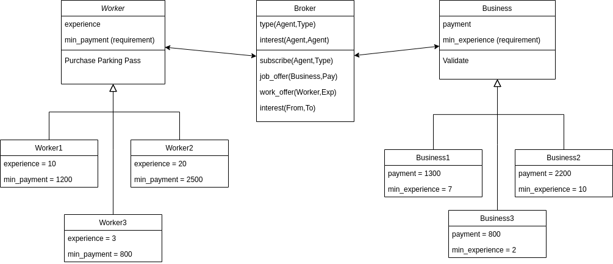
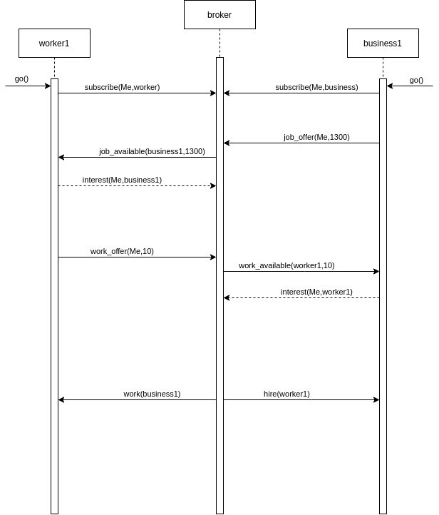

# DALI project
## by Gabriele Tagliente, matr. 279677

# Idea
The basic idea for this project is to implement the job seeking proceess.  
In this model, Businesses offer job positions,
while Workers offer their work.  
This is done with the help of a Broker (agenzia iterinale),
which notifies Workers/Busenesses for new job/work,
and registers their interests.

# Class Diagram

# Sequence Diagram

This diagram shows how the Broker registers new availabilities
and notifies the Workers/Businesses  
(in this model only one for each type is shown,
but the availability notification will be broadcasted to all
agent of the same type).

After a mutual interest is shown between a Worker and a Business,
the Broker will notify both ends for the new contract.

