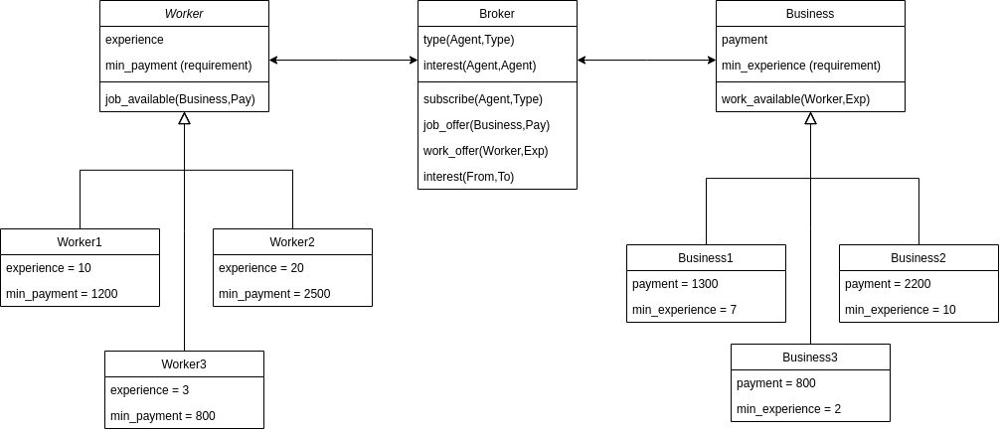

# DALI project
## by Gabriele Tagliente, matr. 279677

# TOC
1. Specification
    1. Agents Types
1. Class Diagram
1. Sequence Diagram
1. Installation
1. Example

# Specification
## Idea
The general idea for this project is to implement the job seeking proceess.  
In this model, Businesses offer job positions,
while Workers offer their work.  
This is done with the help of a Broker (agenzia iterinale),
which notifies Workers/Busenesses for new job/work,
and registers their interests.

## Agent Types

# Class Diagram

Components:
* **Worker**: this class represents a worker, which has some years of experience and wants a minimum salary from the job to accept it.  
All the workers are extensions of this general class.
* **Business**: this class represents a business, which offers some pay for the job and wants a minimum amount of years of experience for a woirker to hire it.  
All the businesses are extensions of this general class.
* **Broker**: the agency which collects all the data, put workers and businesses in contact, and registers mutual interests.
In the end takes care of making new job contracts.  
_Workers_ and _Businesses_ only talk via the _Broker_

# Sequence Diagram

This diagram shows how the Broker registers new availabilities
and notifies the Workers/Businesses  
(in this model only one for each type is shown,
but the availability notification will be broadcasted to all
agent of the same type).

After a mutual interest is shown between a Worker and a Business,
the Broker will notify both ends for the new contract.

# Installation
Installation instructions:
no particular information is required in order to install this project,
apart from the normal [DALI](https://github.com/AAAI-DISIM-UnivAQ/DALI) instalation instructions.

The project has been implemented and executed on a Linux OS.

* Have a running [Sicstus](https://sicstus.sics.se/) installation.  
    See [this guide](https://sicstus.sics.se/eval.html) to seek the product evaluation
* open a terminal in the directory where you want to install it.
* clone this repository on the local system:  
    `git clone https://github.com/realgabriele/dali-2022.git`
* enter into the repo directory:  
    `cd dali-2022`
* open the file `src/startmas.sh` to edit the `SICSTUS_HOME` variable and adjust it to your own sicstus installation path.

### Program Execution
* start the program:  
    `./startmas.sh`
* in the user window, send the following commands
in order to wake the agents.
* ToDo: continue with messages (i.e. go() )

### Exit the program
* To interrupt the entire execution,
press any key on the original terminal.

### Common problems
* After a single execution,
it is needed to wait for 60 seconds
before restart another round.

# Example
Following some screenshot showing an example of execution.

ToDo: screenshot
